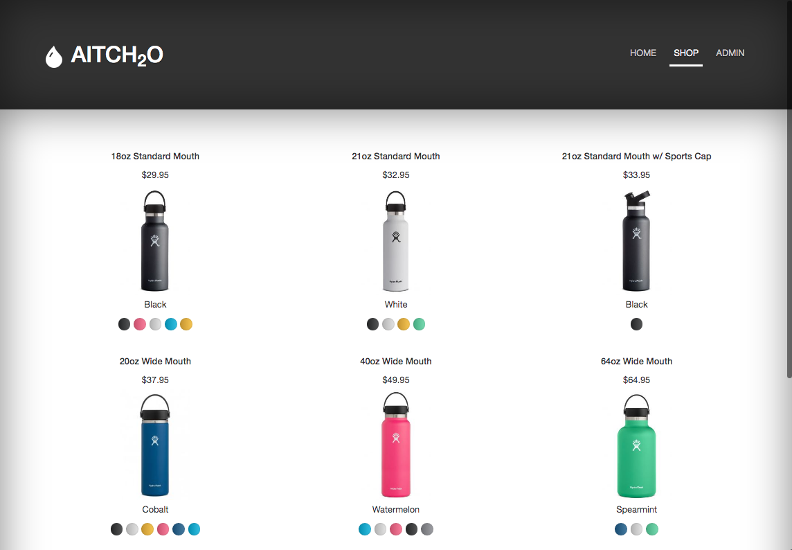
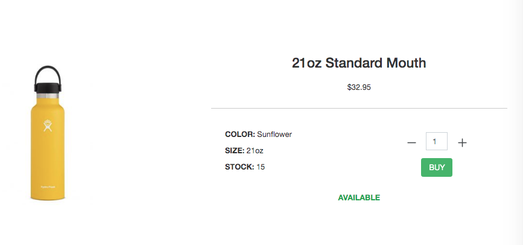
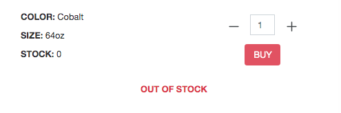
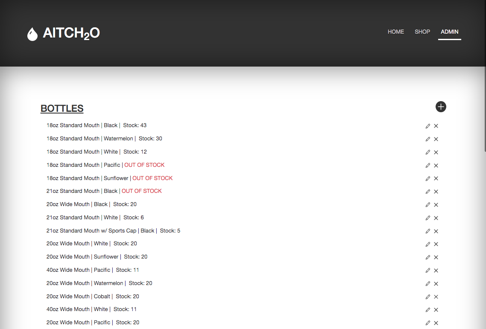
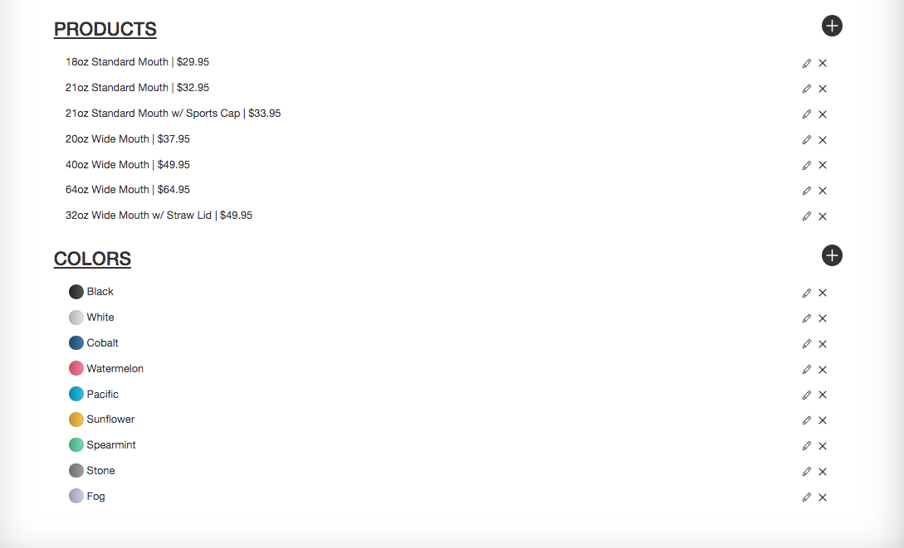
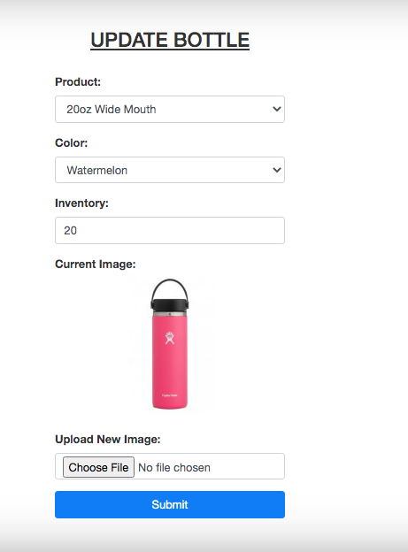

# Inventory Application

This project was completed as part of The Odin Project - NodeJS Curriculum. The assignment brief was to build a functioning inventory management application for a business using the CRUD method and following the MVC design pattern. You can find the full list of project requirements [here](https://www.theodinproject.com/courses/nodejs/lessons/inventory-application).

# 

I choose to make a water bottle business, the bottles were built up of two models, color and product type. These were used to create, update bottles and then were unable to be deleted while still in use. I made all destructive actions only accessible via an admin page which is password protected. I added the ability to upload images of the product to make my content more visually appealing.

i made the stock visible and created a buy function to simulate the site in use, with real time stock updates and the pages dynamically changing when items 'sell out'.

> Product In-Stock

# 

> Product Out of Stock

# 

#### Admin Features

> Admin Page showing all products with the create, update and delete buttons

# 

# 

> Create/Update Form

# 

If you are interested in playing around with the destructive features of the website, feel free to create a pull request or message me directly for the admin password.

## Table of contents

1. [Demo](#demo)
2. [Technologies](#technologies)
3. [Features](#features)
4. [Development](#development)
5. [License](#license)

## Demo

Here is the working live demo:
[https://bgwd-inventory-application.herokuapp.com/shop](https://bgwd-inventory-application.herokuapp.com/shop).

## Technologies

- Modern JavaScript (ES6 +)
- [Handlebars](https://handlebarsjs.com/)
- [Bootstrap](https://getbootstrap.com/)
- [NodeJS](https://nodejs.org/en/)
- [ExpressJS](https://expressjs.com/)
- [MongoDB](https://www.mongodb.com/)
- [Heroku](https://www.heroku.com/about)

  
  
  
  
  
  

## Features

- CRUD application w/ password protected destructive features
- Uses an MVC model
- .hbs template engine
- MongoDB NoSQL Database
- Real time product stock view
- Customer simulation (buy products)
- Create, Update and Delete products and product models
- Range of express middleware such as express-validator and multer

## Development

- Create optional search/filter methods (color/product etc)
- Find a way to keep individual user logged on to admin features without making features accessible to anyone on site.

## License

> You can check out the full license [here](LICENSE)

This project is licensed under the terms of the **MIT** license.

#### This README was made using my [React ReadMe Maker](https://benjamin-gambling.github.io/markdown-previewer/)
